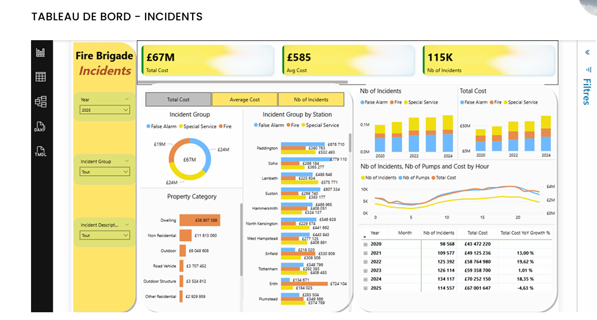

# Optimisation des temps de réponse - London Fire Brigade

# Contexte du projet
L'augmentation des incidents climatiques, la concentration démographique et les pressions financières exigent de la London Fire Brigade (LFB) une efficacité renforcée dans la gestion de ses interventions. 
L'objectif de ce projet est d'analyser les temps de réponse et de mobilisation de la LFB afin d'optimiser l'allocation des ressources et d'améliorer la coordination inter-services, tout en maîtrisant les coûts.

# Données et Stack Technique
Sources des données : Fichiers d'enregistrements des Incidents (2018-2024) et des Mobilisations (2021-2025) contenant des centaines de milliers de lignes.
# Outils utilisés : Python (Exploration, Pré-processing, Tests statistiques) et Power BI (Conception de tableaux de bord et Visualisation).
# Lien vers le code source : https://colab.research.google.com/drive/10p9gTX73ZJA7tux2IFuKylDibAcgjhYc?usp=sharing

# Méthodologie
1.  **Nettoyage et Pré-traitement (Python) :** Gestion des valeurs manquantes (ex: `DelayCode`, `SpecialServiceType`), standardisation des formats géographiques, suppression des doublons et fusion complexe des tables Incidents et Mobilisations.
2.  **Analyse Statistique (Python) :** Utilisation de modèles statistiques pour valider les hypothèses métiers : corrélation de Pearson, test ANOVA sur les coûts, et test t de Student (Welch) sur les pics horaires.
3.  **Data Visualisation (Power BI) :** Création d'un tableau de bord interactif divisé en deux axes (Incidents et Mobilisations) avec des indicateurs clés (Temps de réponse, Nombre de véhicules, Coût de la mobilisation).

# Insights Clés
*   **Performance des temps d'arrivée :** 72,9 % des premiers camions arrivent sur les lieux en moins de 6 minutes (le temps moyen est de 5,16 minutes).
*   **Une forte corrélation horaire :** L'activité suit un pic structurel majeur entre 16h et 21h nécessitant +97 % de ressources supplémentaires par rapport aux heures creuses, une différence validée par le test de Welch. La LFB ajuste ses ressources quasi proportionnellement à la demande (2,2 véhicules par incident).
*   **Structure des coûts (Test ANOVA) :** Les fausses alertes (False Alarms) représentent 60 % du volume total des interventions, mais les incendies (Fires), qui ne pèsent que 15,5 % du volume, ont un coût moyen par intervention nettement supérieur (£1 296 contre £427).
*   **Hétérogénéité territoriale :** Des écarts de coûts importants existent entre les "boroughs" (ratio de 1,7x entre le plus et le moins cher). De plus, certaines casernes mettent presque deux fois plus de temps que d'autres à intervenir, avec des extrêmes allant de 0,36 min à 18,48 min de temps moyen.

# Recommandations Métier
**Allocation des effectifs :** Renforcer les équipes et baser les plannings spécifiquement sur le créneau critique de 16h à 21h.
**Optimisation financière :** Investir davantage dans la prévention des incendies et déployer des systèmes intelligents pour réduire le volume massif des fausses alertes.
**Stratégie territoriale :** Mettre en place un suivi budgétaire renforcé pour les boroughs les plus coûteux et réaliser un diagnostic ciblé (trafic, couverture) pour les casernes les plus lentes.

---
